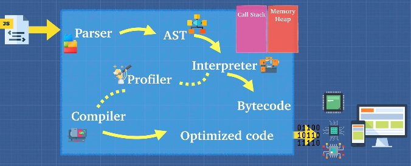
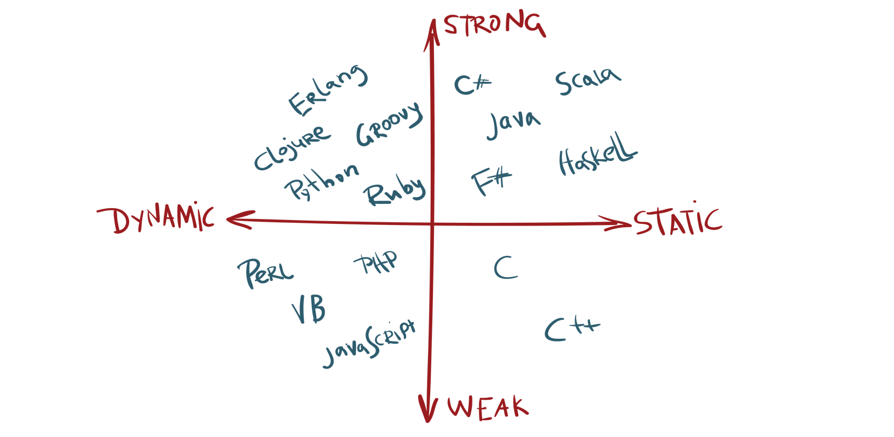

## JavaScript: The Advanced Concepts

<a href='https://zerotomastery.io/cheatsheets/javascript-cheatsheet-the-advanced-concepts/#writing-optimized-code'> CheatSheet </a>

---

- [JS Foundation](#1)
  - [JS Engine](#2)
  - [Writing Optimized Code (Memoization, Hidden Classes, Inline Caching, Managing arguments, WebAssembly)](#3)
  - [Call Stack and Memory Heap](#4)
  - [Stack Overflow](#5)
  - [Garbage Collection](#6)
  - [JS Runtime](#7)
  - [Execution Context, Lexical Environment, Scope Chain, Hoisting](#8)
  - [The arguments object](#9)
  - [Function Scope and Block Scope](#10)
  - [IIFE](#11)
  - [`this` keyword](#12)
  - [call(), apply(), bind(), Currying with bind](#13)
- [JS Types](#14)
  - [Primitive and Non-primitive JS Types](#141)
  - [Type coercion](#15)
  - [Static vs Dynamic Typed](#16)
- [Closures and Prototypal Inheritance](#17)
  - [Function review ](#18)
  - [Closures](#19)
  - [Prototypal Inheritance](#20)
- [Object Oriented Programming](#21)
  - [OOP introduction](#22)
  - [this](#23)
  - [Private and Public Fields](#24)
  - [4 pillars of OOP](#25)
- [Functional Programming](#26)
  - [Pure function](#27)
  - [Referential transparency](#28)
  - [](#29)
- [OOP vs FP]
- [Asynchronous JS]
- [Modules in JS]
- [Error Handling]

---

## 🚩 JS FOUNDATION <a name="1"></a>

### 📒 Javascript Engine <a name="2"></a>

A `JavaScript engine` is a computer program that you give JavaScript code to and it tells the computer how to execute it. Basically a translator for the computer between JavaScript and a language that the computer understands.

There are many JavaScript Engines out there and typically they are created by web browser vendors. All engines are standardized by `ECMA Script` or `ES`.



`Parsing` is the process of analyzing the source code, checking it for errors, and breaking it up into parts.

The parser produces a data structure called the `Abstract Syntax Tree` or `AST`. AST is a tree graph of the source code that does not show every detail of the original syntax, but contains structural or content-related details. Certain things are implicit in the tree and do not need to be shown, hence the title abstract.

An `interpreter` directly executes each line of code line by line, without requiring them to be compiled into a machine language program. Interpreters can use different strategies to increase performance. They can parse the source code and execute it immediately, translate it into more efficient machine code, execute precompiled code made by a compiler, or some combination of these.

The `compiler` works ahead of time to convert instructions into a machine-code or lower-level form so that they can be read and executed by a computer. It runs all of the code and tries to figure out what the code does and then compiles it down into another language that is easier for the computer to read.

<a href='https://babeljs.io/'>Babel</a> is a Javascript compiler that takes your modern JS code and returns browser compatible JS (older JS code). <a href='https://www.typescriptlang.org/'>Typescript</a> is a superset of Javascript that compiles down to Javascript. Both of these do exactly what compilers do. Take one language and convert into a different one!

In modern engines, the interpreter starts reading the code line by line while the profiler watches for frequently used code and flags then passes is to the compiler to be optimized.

In the end, the JavaScript engine takes the bytecode the interpreter outputs and mixes in the optimized code the compiler outputs and then gives that to the computer. This is called `"Just in Time"` or `JIT` Compiler.

### 📒 Writing Optimized Code <a name="3"></a>

`Memoization` is a way to cache a return value of a function based on its parameters. This makes the function that takes a long time run much faster after one execution. If the parameter changes, it will still have to reevaluate the function.

```javascript
// Bad Way
function addTo80(n) {
  console.log('long time...')
  return n + 80
}

addTo80(5)
addTo80(5)
addTo80(5)

// long time... 85
// long time... 85
// long time... 85

// Memoized Way
functions memoizedAddTo80() {
  let cache = {}
  return function(n) { // closure to access cache obj
    if (n in cache) {
      return cache[n]
    } else {
      console.log('long time...')
      cache[n] = n + 80
      return cache[n]
    }
  }
}
const memoized = memoizedAddTo80()

console.log('1.', memoized(5))
console.log('2.', memoized(5))
console.log('3.', memoized(5))
console.log('4.', memoized(10))

// long time...
// 1. 85
// 2. 85
// 3. 85
// long time...
// 4. 90
```

More information:

> <a href ="https://richardartoul.github.io/jekyll/update/2015/04/26/hidden-classes.html">Javascript Hidden Classes and Inline Caching</a>

> <a href='https://github.com/petkaantonov/bluebird/wiki/Optimization-killers#3-managing-arguments'>Managing arguments</a>

> <a href="https://webassembly.org/">WebAssembly</a>

### 📒 Call Stack and Memory Heap <a name="4"></a>

The JavaScript engine does a lot of work for us, but 2 of the biggest jobs are reading and executing it. We need a place to store and write our data and a place to keep track line by line of what's executing.
That's where the call stack and the memory heap come in.

The `memory heap` is a place to store and write information so that we can use our memory appropriately. It is a place to allocate, use, and remove memory as needed. Think of it as a storage room of boxes that are unordered.

The `call stack` keeps track of where we are in the code, so we can run the program in order.

### 📒 Stack Overflow <a name="5"></a>

So what happens if you keep calling functions that are nested inside each other? When this happens it's called a **stack overflow**.

```javascript
// When a function calls itself,
// it is called RECURSION
function inception() {
  inception();
}

inception();
// returns Uncaught RangeError:
// Maximum call stack size exceeded
```

### 📒 Garbage Collection <a name="6"></a>

JavaScript is a garbage collected language. If you allocate memory inside of a function, JavaScript will automatically remove it from the memory heap when the function is done being called.
However, that does not mean you can forget about `memory leaks`. No system is perfect, so it is important to always remember memory management. JavaScript completes garbage collection with a `mark` and `sweep` method.

<a href="https://developers.soundcloud.com/blog/garbage-collection-in-redux-applications"> More info ... </a>

### 📒 JavaScript Runtime <a name="7"></a>

When you visit a web page, you run a browser to do so (Chrome, Firefox, Safari, Edge). Each browser has its own version of `JavaScript Runtime` with a set of `Web API's`, methods that developers can access from the window object.

In a synchronous language, only one thing can be done at a time. Imagine an alert on the page, blocking the user from accessing any part of the page until the OK button is clicked. If everything in JavaScript that took a significant amount of time, blocked the browser, then we would have a pretty bad user experience.

This is where `concurrency` and the `event loop` come in. When you run some JavaScript code in a browser, the engine starts to parse the code. Each line is executed and popped on and off the call stack.

Web API's are not something JavaScript recognizes, so the parser knows to pass it off to the browser for it to handle. When the browser has finished running its method, it puts what is needed to be ran by JavaScript into the callback queue. The callback queue cannot be ran until the call stack is completely empty. So, the event loop is constantly checking the call stack to see if it is empty so that it can add anything in the callback queue back into the call stack. And finally, once it is back in the call stack, it is ran and then popped off the stack.

Until 2009, JavaScript was only run inside of the browser. That is when Ryan Dahl decided it would be great if we could use JavaScript to build things outside the browser. He used C and C++ to build an executable (exe) program called `Node JS`. Node JS is a JavaScript runtime environment built on Chrome's V8 engine that uses C++ to provide the event loop and callback queue needed to run asynchronous operations.

### 📒 Execution Context, Lexical Environment, Scope Chain, Hoisting <a name="8"></a>

Code in JavaScript is always run inside a type of execution context. `Execution context` is simply the environment within which your code is ran. There are 2 types of execution context in JavaScript, `global` or `function`. There are 2 stages as well to each context, the creation and executing phase. As the JavaScript engine starts to read your code, it creates something called the Global Execution Context.

A `lexical environment` is basically the scope or environment the engine is currently reading code in. A new lexical environment is created when curly brackets {} are used, even nested brackets {{...}} create a new lexical environment. The execution context tells the engine which lexical environment it is currently working in and the lexical scope determines the available variables.

Each environment context that is created has a link outside of its lexical environment called the `scope chain`. The scope chain gives us access to variables in the parent environment.

```javascript
function sayMyName() {
  var a = "a";
  return function findName() {
    var b = "b";
    return function printName() {
      var c = "c";
      return "String";
    };
  };
}

sayMyName()()(); //each function is returned and has to be called

// The functions only get access to the variables in their parent container, not a child. The scope chain only links down the call stack
```

`Hoisting` is the process of putting all variable and function declarations into memory during the compile phase. In JavaScript, functions are fully hoisted, var variables are hoisted and initialized to undefined, and let and const variables are hoisted but not initialized a value. Var variables are given a memory allocation and initialized a value of undefined until they are set to a value in line. So if a var variable is used in the code before it is initialized, then it will return undefined. However, a function can be called from anywhere in the code base because it is fully hoisted. If let and const are used before they are declared, then they will throw a reference error because they have not yet been initialized.

### 📒 The arguments object <a name="9"></a>

Arguments looks like an array, but it's not really an array. There are many things that you can do with the arguments keyword that might make the compiler or the JavaScript engine less able to optimize your code because you can't really use array methods on this. And with the new JavaScript, they introduced a few little tools that we can use so that we avoid using arguments, because there are some cases where we might want to iterate or loop through arguments instead of just accessing them regularly.

```javascript
function marry (person1, person2){
  console.log(arguments)
  console.log(Array.from(arguments))
  return `${person1}` is now merried with `${person2}`
}

marry ('Tim', 'Tina')

// {0: 'Tim, 1: 'Tina'}
// ['Tim', 'Tina']
```

```javascript
function marry (...args){
  console.log(args)
  console.log(Array.from(arguments))
  return `${args[0]}` is now merried with `${args[1]}`
}

marry ('Tim', 'Tina')

// ['Tim', 'Tina']
// ['Tim', 'Tina']
```

<a href='https://developer.mozilla.org/en-US/docs/Web/JavaScript/Reference/Functions/arguments'>More info ... </a>

### 📒 Function Scope and Block Scope <a name="10"></a>

Most programming languages are block scoped, meaning every time you see a new { } (curly braces) is a new lexical environment.

However, JavaScript is function scoped, meaning it only creates a new local environment if it sees the keyword function on the global scope.

To give us access to block scope, in ES6 `let` and `const` were added to the language. Using these can prevent memory leaks, but there is still an argument to be made for using `var`.

```javascript
//Function Scope
function loop() {
  for (var i = 0; i < 5; i++) {
    console.log(i);
  }
  console.log("final", i); // returns final 5
}

//Block Scope
function loop2() {
  for (let i = 0; i < 5; i++) {
    // can access i here
  }
  console.log("final", i); // returns an error
}

loop();
/*
  1
  2
  3
  4
  final 5
*/
loop2();
// ReferenceError: i is not defined
```

Variable declarations with let and const work differently from the var variable declaration. When a lexical scope is entered and the execution context is created, the engine allocates memory for any `var` variable in that scope and initializes it to undefined. The `let` and `const` variables only get initialized on the line they are executed on and only get allocated undefined if there is no assignment to the variable. Trying to access a `let` or `const` variable before it is declared or outside of its block without returning it will result in a Reference Error.

### 📒 IIFE <a name="11"></a>

`Immediately Invoked Function Expression` is a JavaScript function that runs as soon as it is defined. Can also be referred to as a Self-Executing Anonymous Function.

```javascript
// Grouping Operator () creates a lexical scope
(function () {
  // statements
})();
// Immediately invokes the function with 2nd set of ()
```

### 📒 `this` keyword<a name="12"></a>

`this` is the object that the function is a property of (example: obj.someFunc(this))

```javascript
// Example where 'this' becomes useful and the reason that this keyword was created.
//Two main benefits of why the this keyword was created:
// 1. gives methods access to their object.
const obj = {
  name: "Veronica",
  sing: function () {
    return "lalala " + this.name;
  },
  singAgain() {
    return "lalala " + this.name + "!";
  },
  singTwo() {
    return this.sing() + "!";
  },
};
obj.sing(); // lalala Veronica
obj.singAgain(); // lalala Veronica!
obj.singTwo(); // lalala Veronica!

// 2. execute the same code for multiple objects
function importantPerson() {
  console.log(this.name + "!");
}
const name = "Sunny";
const obj1 = {
  name: "Cassy",
  importantPerson: importantPerson,
};
const obj1 = {
  name: "Jacob",
  importantPerson: importantPerson,
};

importantPerson(); // Sunny!
obj1.importantPerson(); // Cassy!
obj2.importantPerson(); // Jacob!
```

A big gotcha for a lot of people working with \*this is when a function is ran inside of another function. It gets a little confusing, but we can remember who called the function.

```javascript
const obj = {
  name: "Billy",
  sing() {
    console.log("a", this);
    var anotherFunc = function () {
      console.log("b", this);
    };
    anotherFunc();
  },
};
obj.sing();

// a {name: "Billy", sing: ƒ}
// b Window {…}
```

In the example above, the obj called sing() and then anotherFunc() was called within the sing() function. In JavaScript, that function defaults to the Window object. It happens because everything in JavaScript is lexically scoped except for the this keyword. It doesn't matter where it is written, it matters how it is called. Changing anotherFunc() instead to an arrow function will fix this problem. Arrow functions do not bind or set their own context for this.

If this is used in an arrow function, it is taken from the outside. Arrow functions also have no arguments created as functions do.

```javascript
const obj = {
  name: "Billy",
  sing() {
    console.log("a", this);
    var anotherFunc = () => {
      console.log("b", this);
    };
    anotherFunc();
  },
};
obj.sing();

// a {name: "Billy", sing: ƒ}
// b {name: "Billy", sing: ƒ}
```

Here is `this` 4 ways:

- new keyword binding - the new keyword changes the meaning of "this" to be the object that is being created.
- implicit binding - "this" refers to the object that is calling it. It is implied, without doing anything its just how the language works.
- explicit binding - using the "bind" keyword to change the meaning of "this".
- arrow functions as methods - "this" is lexically scoped, refers to it's current surroundings and no further. However, if "this" is inside of a method's function, it falls out of scope and belongs to the window object. To correct this, you can use a higher order function to return an arrow function that calls "this".

```javascript
// new binding
function Person(name, age) {
  this.name = name;
  this.age = age;
  console.log(this);
}

const person1 = new Person("person1", 55);
// this = Person { name: 'person1', age: 55 }

//implicit binding
const person = {
  name: "person",
  age: 20,
  hi() {
    console.log("hi " + this);
  },
};

person.hi();
// this = person { name: 'person', age: 20, hi(){...} }

//explicit binding
let name = "Brittney";

const person3 = {
  name: "person3",
  age: 50,
  hi: function () {
    console.log("hi " + this.name);
  }.bind(window),
};

person3.hi();
// hi Brittney
// this = window {...}

// arrow functions inside objects
const person4 = {
  name: "person4",
  age: 40,
  hi: function () {
    var inner = () => {
      console.log(this);
    };
    return inner();
  },
};

person4.hi();
// this = person4 { name: 'person4', age: 40, hi() {...} }
// if either function is changed around, it doesn't work
```

### 📒 call(), apply(), bind(), Currying with bind <a name="13"></a>

`Call` is a method of an object that can substitute a different object than the one it is written on.

```javascript
function a() {
  console.log("hi");
}

a.call(); // hi
```

`Apply` is almost identical to call, except that instead of a comma separated list of arguments, it takes an array of arguments.

Unlike call and apply, `bind` does not run the method it is used on, but rather returns a new function that can then be called later.

```javascript
const wizard = {
  name: "Merlin",
  health: 100,
  heal(num1, num2) {
    return (this.health += num1 + num2);
  },
};

const archer = {
  name: "Robin Hood",
  health: 30,
};
console.log(archer); // health: 30
wizard.heal.call(archer, 50, 30);
console.log(archer); // health: 110

console.log(archer); // health: 30
wizard.heal.apply(archer, [50, 30]);
console.log(archer); // health: 110

console.log(archer); // health: 30
const healArcher = wizard.heal.bind(archer, 50, 20);
healArcher();
console.log(archer); // health: 100
```

`Currying` is breaking down a function with multiple arguments into one or more functions that each accept a single argument.

```javascript
function multiply(a, b) {
  return a * b;
}

let multiplyByTwo = multiply.bind(this, 2);
multiplyByTwo(4); // 8

let multiplyByTen = multiply.bind(this, 10);
multiplyByTen(6); // 60
```

---

## 🚩 JS Types <a name="14"></a>

### 📒 Primitive and Non-primitive JS Types <a name="141"></a>

`Primitive type` - is a data that only represents a single value. Primitive types are immutable. The variable assigned to a primitive type may be reassigned to a new value, but the original value can not be changed in the same way objects can be modified. Primitives are passed by value, meaning their values are copied and then placed somewhere else in the memory.

- <a href='https://developer.mozilla.org/en-US/docs/Glossary/Number'>Number</a>

```javascript
typeof 37 === "number";
typeof 3.14 === "number";
typeof 42 === "number";
typeof Math.LN2 === "number";
typeof Infinity === "number";
typeof NaN === "number"; // Despite being "Not-A-Number"
typeof Number("1") === "number"; // Number tries to parse things into numbers
typeof Number("shoe") === "number"; // including values that cannot be type coerced to a number
```

- <a href='https://developer.mozilla.org/en-US/docs/Glossary/BigInt'>BigInt</a>

```javascript
typeof 42n === "bigint";
```

- <a href='https://developer.mozilla.org/en-US/docs/Glossary/String'>String</a>

```javascript
typeof "" === "string";
typeof "bla" === "string";
typeof `template literal` === "string";
typeof "1" === "string"; // note that a number within a string is still typeof string
typeof typeof 1 === "string"; // typeof always returns a string
typeof String(1) === "string"; // String converts anything into a string, safer than toString
```

- <a href='https://developer.mozilla.org/en-US/docs/Glossary/Boolean'>Boolean</a>

```javascript
typeof true === "boolean";
typeof false === "boolean";
typeof Boolean(1) === "boolean"; // Boolean() will convert values based on if they're truthy or falsy
typeof !!1 === "boolean"; // two calls of the ! (logical NOT) operator are equivalent to Boolean()
```

- <a href='https://developer.mozilla.org/en-US/docs/Glossary/Symbol'>Symbol</a>

```javascript
typeof Symbol() === "symbol";
typeof Symbol("foo") === "symbol";
typeof Symbol.iterator === "symbol";
```

- <a href='https://developer.mozilla.org/en-US/docs/Glossary/Null'>Null</a> - absence of value

```javascript
typeof Null === "object";
// Why does the typeof null return object? When JavaScript was first implemented, values were represented as a type tag and a value. The objects type tag was 0 and the NULL pointer (0x00 in most platforms) consequently had 0 as a type tag as well. A fix was proposed that would have made typeof null === 'null', but it was rejected due to legacy code that would have broken.
```

- <a href='https://developer.mozilla.org/en-US/docs/Glossary/Undefined'>Undefined</a> - absence of definition

```javascript
typeof undefined === "undefined";
typeof declaredButUndefinedVariable === "undefined";
typeof undeclaredVariable === "undefined";
```

`Non-primitive type`

- <a href='https://developer.mozilla.org/en-US/docs/Glossary/Function'>Function</a>

```javascript
typeof function () {} === "function";
typeof class C {} === "function";
typeof Math.sin === "function";
```

- Object

  Objects are one of the broadest types in JavaScript, almost "everything" is an object.
  <a href="https://developer.mozilla.org/en-US/docs/Web/JavaScript/Reference/Global_Objects">Standard built-in objects</a>

  - Booleans can be objects (if defined with the new keyword)
  - Numbers can be objects (if defined with the new keyword)
  - Strings can be objects (if defined with the new keyword)
  - Dates are always objects
  - Maths are always objects
  - Regular expressions are always objects
  - Arrays are always objects
  - Functions are always objects
  - Objects are always objects

```javascript
typeof { a: 1 } === "object";

// use Array.isArray or Object.prototype.toString.call
// to differentiate regular objects from arrays
typeof [1, 2, 4] === "object";

typeof new Date() === "object";
typeof /regex/ === "object"; // See Regular expressions section for historical results

// The following are confusing, dangerous, and wasteful. Avoid them.
typeof new Boolean(true) === "object";
typeof new Number(1) === "object";
typeof new String("abc") === "object";
```

<a href='https://developer.mozilla.org/en-US/docs/Web/JavaScript/Reference/Global_Objects'> More info ... </a>

Objects are able to be mutated and their properties are passed by reference, meaning their properties are not stored separately in memory. A new variable pointing to an object will not create a copy, but reference the original objects location in memory. Therefore, changing the 2nd object will also change the first.

```javascript
// objects are passed by reference
let obj = {
  name: "object 1",
};
let newObj = obj; // points to same place in memory as obj
newObj.name = "newObj"; // modifies the memory
// Since both point to the same place...
console.log(obj); // {name: newObj}
console.log(newObj); // {name: newObj}
// They are both modified.

let arr = [1, 2, 3];
let newArr = arr;
newArr.push(4);
console.log(arr); // [1, 2, 3, 4]
console.log(newArr); // [1, 2, 3, 4]
```

There are two ways to get around this, `Object.assign()` or use the `spread operator {...}` to "spread" or expand the object into a new variable. By doing this, it will allow the new variable to be modified without changing the original. However, these only create a "shallow copy".

`Shallow copy` is a bit-wise copy of an object. A new object is created that has an exact copy of the values in the original object. It clone the first level.

If any of the fields of the object are references to other objects, just the reference addresses are copied i.e., only the memory address is copied.

`Deep copy` copies all fields, and makes copies of dynamically allocated memory pointed to by the fields. A deep copy occurs when an object is copied along with the objects to which it refers. To make a deep cloning we can use JSON.
<a href="https://medium.com/@manjuladube/understanding-deep-and-shallow-copy-in-javascript-13438bad941c">Understanding Deep and Shallow Copy in Javascript</a>

```javascript
const originalObj = {
  nested: {
    nestedKey: "nestedValue",
  },
  key: "value",
};
// originalObj points to location 1 in memory
const assignObj = originalObj;
// assignObj will point to 1 in memory
const shallowObj = { ...originalObj };
// shallowObj points to a new location 2, but references location 1 for the nested object
const deepObj = JSON.parse(JSON.stringify(originalObj));
// deepObj clones all parts of the object to a new memory address
```

The global <a href="https://developer.mozilla.org/en-US/docs/Web/API/structuredClone">structuredClone()</a> method creates a deep clone of a given value using the structured clone algorithm.

<a href="https://web.dev/articles/structured-clone"> More info ... </a>

If you try to check if 2 objects with the same properties are equal with `obj1 = obj2`, it will return `false`. It does this because each object has its own address in memory as we learned about. The easiest way to check the contents of the objects for equality is this.

```javascript
JSON.stringify(obj1) === JSON.stringify(obj2);
```

### 📒 Type coercion <a name="15"></a>

Type coercion is the process of converting one type of value into another. There are 3 types of conversion in JavaScript.

- to string
- to boolean
- to number

<a href="https://dorey.github.io/JavaScript-Equality-Table/"> JS Equality Table</a>

### 📒 Static vs Dynamic Typed <a name="16"></a>

The major difference between static and dynamic typed languages is when the types of variables are checked. `Static` typed languages (Java, C, C++, C#) are checked during the compile stage, so all types are known before run-time. `Dynamic` languages (JavaScript, PHP, Python, Ruby, Perl) are checked on the fly, during the execution stage.

Also, after dividing the languages into dynamic and static, they are then divided again into strong and weak typed. `Weakly` typed (JavaScript, PHP, C, C++) languages can make type coercions implicitly. `Strongly` typed (Python, Ruby, C#, Java) do not allow conversions between unrelated types.



---

## 🚩 Closures and Prototypal Inheritance <a name="17"></a>

### 📒 Function review <a name="18"></a>

When we invoke a function, we get two parameters automatically (`this` keyword and `arguments` keyword)
There are few ways of invoking and creating functions.

```javascript
// 1
function one() {
  return 1;
}
one();

// 2 method - invoking a function is as a method
const obj = {
  two: function () {
    // or just two(){}
    return 2;
  },
};
obj.two();

// 3 - using the call
function three() {
  return 3;
}
three.call();

// 4 - constructor
// It accepts parameters and whatever is in the last parameter of the function will be the actual code body.
const four = new Function("num", "return num");
four(4);
// Almost everything in JavaScript can be created with a constructor. Even basic JavaScript types like numbers and strings can be created using a constructor.

// examples of constructor functions in JavaScript
const five = new Number(5);
const assignFive = 5;

// this is different than using regular assignment
const newString = new String(`I am a new string`);
const assignString = `I am an assigned string`;
```

`Higher order functions` is a function that either takes a function as an argument or returns another function. There are 3 kinds of functions in JavaScript:

- function ()
- function (a,b)
- function hof() { return function () {} }

```javascript
// 1 - assign function to variables
var stuff = function () {};

// 2 - pass function into arguments
function a(fn) {
  fn();
}
a(function () {
  console.log("hi");
});

// 3 - return function as a value from another function
function b() {
  return function c() {
    console.log("bye");
  };
}
b();
b()();
```

Instead of writing multiple functions that do the same thing, remember DRY (don't repeat yourself). Imagine in the example below, if you separated each code out into individual functions how much more code you would be writing and how much code would be repeated. Take the example below of how you can separate code out and break it down to make it more reusable.

```javascript
function multBy(a) {
  return function (b) {
    return a * b;
  };
}

// can also be an arrow function
const multiplyBy = (a) => (b) => a * b;

const multByTwo = multiplyBy(2);
const multByTen = multiplyBy(10);

multByTwo(4); // 8
multByTen(5); // 50
```

### 📒 Closures <a name="19"></a>

`Closure` is simply a combination of function and the lexical environment from which it was declared. Closures allow a function to access variables from an enclosing scope or environment even after it leaves the scope in which it was declared. In other words, a closure gives you access to its outer functions scope from the inner scope. The JavaScript engine will keep variables around inside functions that have a reference to them, instead of "sweeping" them away after they are popped off the call stack.

```javascript
function a() {
  let grandpa = 'grandpa'
  return function b() {
    let father = 'father'
    let random = 12345 // not referenced, will get garbage collected
    return function c() {
      let son = 'son'
      return `closure inherited all the scopes: ${grandpa} > ${father} > ${son}`
    }
  }
}

a()()() // closure inherited all the scopes: grandpa > father > son

// An example with arrow function
const closure = grandma => mother => daughter => return `${grandma} > ${mother} > ${daughter}`

// grandma > mother > daughter
```

So closure is a feature of JavaScript. Function C is inside a function A and function B, the JavaScript engine is going to say - "All right, I'll create a closure for you. All the variables outside of the function C I'm going to keep around if C is using it."

Two of the major reasons closures are so beneficial are `memory efficiency` and `encapsulation`.

Using closures makes your code more memory efficient.

```javascript
function inefficient(idx) {
  const bigArray = new Array(7000).fill("😄");
  console.log("created!");
  return bigArray[idx];
}

function efficient() {
  const bigArray = new Array(7000).fill("😄");
  console.log("created again!");
  return function (idx) {
    return bigArray[idx];
  };
}

inefficient(688);
inefficient(1000);
inefficient(6500);

const getEfficient = efficient();

efficient(688);
efficient(1000);
efficient(6500);

// inefficient created the bigArray 3 times
// efficient created the bigArray only once
```

`Encapsulation` means the restriction of direct access to some of an object's components. It hides as much as possible of an object's internal parts and only exposes the necessary parts to run. Why use encapsulation?

- Security - Controlled access
- Hide Implementation and Expose Behaviours
- Loose Coupling - Modify the implementation at any time

```javascript
const encapsulation = () => {
  let people = [];
  const setName = (name) => people.push(name);
  const getName = (idx) => people[idx];
  const rmName = (idx) => people.splice(idx, 1);
  return {
    setName,
    getName,
    rmName,
  };
};
const data = encapsulation();
data.setName("Brittney"); // 0
data.getName(0); // 'Brittney'
data.rmName(0); // ['Brittney']
// you have no access to the array people
// can only change it via methods provided
```

### 📒 Prototypal Inheritance <a name="20"></a>

Almost all objects in Javascript pass down properties through a prototype chain. We call this chain, `prototypal inheritance`. The child of the object "inherits" properties from its parent. All objects in JavaScript are descended from the Object constructor unless deliberately created or altered to not do so. The objects inherit methods and properties from Object.prototype.

The prototype property also has an accessor property called `__proto__` that creates a link between the current object and points to the object it was created from, the "prototype".

Only functions has a prototype property and it references to an object used to attach properties that will be inherited by objects further down the prototype chain. The last object in the chain is this built in object.prototype.

```javascript
Object.prototype.__proto__;
// null
// it is end of the chain and nothing to show

Object.prototype;
{
  __proto__: null;
  // ...more methods and properties
}

Object;
// function Object()
// This is the object constructor function

Object.prototype.constructor;
// function Object()
// Points to the constructor

Object.__proto__;
// function () {...}
// Because it is created with a constructor function
```

Example with `__proto__`

```javascript
let dragon = {
  name: "Tanya",
  fire: true,
  fight() {
    console.log("5");
  },
  sing() {
    if (this.fire) {
      console.log(`I am ${this.name}, the breather of fireeeeee`);
    }
  },
};

let lizard = {
  name: "Kiki",
  fight() {
    console.log("1");
  },
};

// Create a prototype chain that that says - I want Lizard to inherit all these properties and methods from Dragon.
lizard.__proto__ = dragon; // we are able to inherite through prototype chain all the properties and methods of the Dragon and override anything that we have already declared in Lizard.
lizard.sing(); // `I am Kiki, the breather of fireeeeee`
lizard.fight(); // 1

dragon.__proto__;
// Base object
dragon.isPrototypeOf(lizard); // true
lizard.isPrototypeOf(dragon); // false

for (let prop in lizard) {
  console.log(prop);
} // name fight fire sing

for (let prop in lizard) {
  if (lzard.hasOwnProperty(prop)) {
    console.log(prop);
  }
} // name fight
```

> Exercise 1

```javascript
// Exercise - extend the functionality of a built in object
// Date object => to have a new method .lastYear() which shows you last year 'YYYY' format.
new Date("1900-10-10").lastYear();
//'1899'
```

> Solution

```javascript
Date.prototype.lastYear = function () {
  return this.getFullYear() - 1;
};
new Date("1900-10-10").lastYear();
```

> Exercise 2

```javascript
// Modify .map() to print'🗺️' at the end of each iteration.
console.log([1, 2, 3].map());
```

> Solution

```javascript
Array.prototype.map = function () {
  let arr = [];
  for (let i = 0; i < this.length; i++) {
    arr.push(this[i] + "🗺️");
  }
};
console.log([1, 2, 3].map());
```

> Exercise

```javascript
// How would you be able to create your own .bind() method using call or apply.
Function.prototype.bind = function () {};
```

> Solution

```javascript
Function.prototype.bind = function (whoIsCallingMe) {
  const self = this;
  return function () {
    return self.apply(whoIsCallingMe, arguments);
  };
};
```

## 🚩 Object Oriented Programming <a name="21"></a>

### 📒 OOP introduction<a name="22"></a>

There are 2 basic philosophies when it comes to how you structure your programs, `object oriented` and `functional`. Each style has its use in programming, it is not one over the other, but merely a preference in style.

`Object Oriented Programming`, or OOP, is the idea that all code should be grouped into "boxes" (objects) to make your program easier to read and understand. Keeping the data encapsulated helps to keep the program organized. Each object has a state that defines what it does and methods (functions on an object) that can use or modify the state Considering almost everything in JavaScript is an object, you would think this would be easy to do.

Example

```javascript
// step 1 - is an object
const elf1 = {
  name: 'Dobby',
  type: 'house',
  weapon: 'cloth',
  say: function() {
    return `Hi, my name is ${this.name}, I am a ${this.type} elf.`
  }
  attack: function() {
    return `attack with ${this.weapon}`
  }
}

const elf2 = {
  name: 'Legolas',
  type: 'high',
  weapon: 'bow',
  say: function() {
    return `Hi, my name is ${this.name}, I am a ${this.type} elf.`
  }
  attack: function() {
    return `attack with ${this.weapon}`
  }
}

elf1.attack()
// attack with cloth
elf2.attack()
// attack with bow
```

Imagine adding more characters, things would get out of control quickly. So, another way to create objects was introduced, `factory functions`. Factory functions return a new object every time they are ran. This could improve the code somewhat.

```javascript
// step 2 - factory function.
function createElf(name, weapon) {
  return {
    name: name,
    weapon: weapon,
    attack() {
      return console.log(name + " attacks with " + weapon);
    },
  };
}

const peter = createElf("Peter", "stones");
peter.attack(); // Peter attacks with stones
const sam = createElf("Sam", "fire");
sam.attack(); // Sam attacks with fire
```

If we added more characters, we would run into some of the same issues again. Not only is the code not DRY, the attack method is being created and taking up memory space for every new elf. This is not very efficient. How do we solve this? Well, we could separate the methods out into a `store`.

```javascript
// step 3 - stores. Separate the methods out into a store in order to make code more efficient.
const elfFunctions = {
  attack: function () {
    return this.name + "atack with " + this.weapon;
  },
};
function createElf(name, weapon) {
  return {
    name: name,
    weapon: weapon,
  };
}

const sam = createElf("Sam", "bow");
const peter = createElf("Peter", "bow");
sam.attack();
```

Having a store saved us some efficiency in memory, but this was a lot of manual work to assign each method. So, we were given `Object.create` to help create this chain without having to assign each method.

```javascript
// step 4 - Object.create
const elfFunctions = {
  attack: function () {
    return this.name + "atack with " + this.weapon;
  },
};

function createElf(name, weapon) {
  // this creates the __proto__ chain to the store
  let newElf = Object.create(elfFunctions);
  newElf.name = name;
  newElf.weapon = weapon;
  return newElf;
}

const dobby = createElf("Dobby", "cloth");
const legolas = createElf("Legolas", "bow");
dobby.attack; // attack with cloth
legolas.attack; // attack with bow
```

Using Object.create is true prototypal inheritance, the code is cleaner and easier to read. However, you will not see this being used in most programs. Before Object.create came around, we had the ability to use `constructor functions`. The number and string functions were constructed and invoked with the new keyword and they were capitalized.

The `new` keyword actually changes the meaning of this for the constructor function. Without `new`, this will point to the window object instead of the object that we just created. Properties added to a constructor function can only be done using the this keyword, regular variables do not get added to the object.

```javascript
// step 5 - Constructor Functions
function Elf(name, weapon) {
  // not returning anything
  this.name = name;
  this.weapon = weapon;
} // All constructor function should start with capital letter

Elf.prototype.attack = function () {
  // cannot be an arrow function
  return "atack with " + this.weapon;
}; // This would need to be repeated for each method.

const sam = new Elf("Sam", "bow"); // new keyword returns the object Elf and creates the Elf constructor. 'new' works with 'this'.
const peter = new Elf("Peter", "bow");
sam.attack();
```

Prototype is a little weird and hard to read unless you really understand your prototypal inheritance. No one really liked using the prototype way of adding methods, so ES6 JavaScript gave us the `class` keyword. However, classes in JavaScript are not true classes, they are syntactic sugar. Under the hood, it is still using the old prototype method. They are in fact just "special functions" with one big difference; functions are hoisted and classes are not. You need to declare your class before it can be used in your codebase.

```javascript
// step 6 - classes
// Class keyword is still just prototypal inheritance
class Elf {
  constructor(name, weapon) {
    this.name = name;
    this.weapon = weapon;
  }
  // attack is outside because everytime we use the New keyword the constructor function gets run
  attack() {
    return `${this.name} Attack with ${this.weapon}`;
  }
}

const peter = new Elf("Peter", "stones");
console.log(peter instanceof Elf); // created instance of a class
const sam = new Elf("Sam", "fire");
console.log(sam.attack());
```

Classes also come with a new method, the constructor that creates and instantiates an object created with class. Classes are able to be extended upon using the `extends` keyword, allowing subclasses to be created. If there is a constructor present in the extended class, the `super` keyword is needed to link the constructor to the base class. You can check if something is inherited from a class by using the keyword `instanceof` to compare the new object to the class.

```javascript
//Inheritance
class Character {
  constructor(name, weapon) {
    this.name = name;
    this.weapon = weapon;
  }

  attack() {
    return `${this.name} Attack with ${this.weapon}`;
  }
}

class Elf extends Character {
  constructor(name, weapon, type) {
    super(name, weapon);
    this.type = type;
  }
}

class Ogre extends Character {
  constructor(name, weapon, color) {
    super(name, weapon);
    this.color = color;
  }

  makeFort() {
    return "Strongest fort in the world made...";
  }
}

const dolby = new Elf("Dolby", "Cloth", "House");
console.log(dolby);
console.log(dolby.attack());

const shrek = new Ogre("Shrek", "Club", "green");
console.log(shrek);
console.log(shrek.attack());
console.log(shrek.makeFort());
```

### 📒 this <a name="23"></a>

```javascript
// 1 way - New binding
// `this` new binding was used with constructor functions.
function Person(name, age) {
  this.name = name;
  this.age = age;
}
const person1 = new Person("Xavier", 55);
person1;

// 2 way - Implicit binding.
// The most common way to use this.
const person2 = {
  name: "Karen",
  age: 40,
  hi() {
    console.log("hi ", +this.name);
  },
};

// 3 way - Explicit binding.
// This use as a window object
const person3 = {
  name: "Karen",
  age: 40,
  hi: function () {
    console.log("hi" + this.setTimeout);
  }.bind(window),
};
person3.hi();

// 4 way - Arrow functions
// With the arrow functions, we can do lexical scoping, wherever we write the function. That's what this binds to. If we run inner here and we run it, everything is working because we're using arrow functions. If we didn't use an arrow function and just used a regular function, in that case, this would be the window object.

const person4 = {
  name: "Karen",
  age: 40,
  hi: function () {
    var inner = () => {
      console.log("hi ", this.name);
    };
    return inner();
  },
};
person4.hi();
```

### 📒 Private and Public Fields <a name="24"></a>

Most class based languages have the ability to create either `public` or `private` fields within a class. Adding these to classes in JavaScript is still an experimental feature in development. Support in browsers is limited, but can be implemented with systems like `Babel`.

Public declarations are set above the constructor and can be used within the class, but do not get added to a new instance.

The `private declarations` are set with the `#` sign in front of the variable and are only accessible within that class, they cannot be accessed or changed from outside.

```javascript
// public declarations
class Rectangle {
  height = 0;
  width;
  constructor(height, width) {
    this.height = height;
    this.width = width;
  }
}

// private declarations
class Rectangle {
  #height = 0;
  #width;
  constructor(height, width) {
    this.#height = height;
    this.#width = width;
  }
}
```

### 📒 4 pillars of OOP <a name="25"></a>

- `Encapsulation`. OOP puts things in an object in a container and organizes things into units that model real world applications. We wrap code into boxes that are related to one another so that these boxes can just interact with each other using the methods and properties that we make available.
- `Abstraction`. Hiding the complexity from the user that is creating simpler interfaces, such class. The idea of abstraction says - "Here are the methods and properties that you can use, don't worry about everything else. I'll do all the calculations behind the scenes."
- `Inheritance`. By inheriting from other classes, we avoid having to rewrite the same code, and we also save memory space by having shared methods.
- `Polymorphism.`. The idea is the ability to call the same method on different objects and each object responding in different way. And polymorphism is useful because we don't have to necessarily copy and paste code over and over. We can re-use some of the functionality from a superclass to adapt to our own specific needs.

---

## 🚩 Functional Programming <a name="26"></a>

### 📒 Pure function<a name="27"></a>

`Functional programming` has the same goals in mind as object oriented programming, to keep your code understanable, easy to extend, easy to maintain, memory efficient, and DRY. Instead of objects, it uses reusable functions to create and act on data.

Functional programming is based on a separation of concerns similar to object oriented programming. However, in functional programming, there is a complete separation between the data and the behaviors of a program. There is also an idea that once something is created, it should not be changed, being immutable. Unlike OOP, shared state is avoided as functional programming works on the idea of `pure functions`.

A `pure function` has no side effects to anything outside of it and given the same input will always output the same value. They do not change any data passed into them, but create new data to return without altering the original.

However, it is not possible to have 100% pure functions. At some point you need to interact with the dom or fetch an api. Even console.log makes a function unpure because it uses the window object outside of the function. The fact is a program cannot exist without side effects.

So, the goal of functional programming is to minimize side effects by isolating them away from the data. Build lots of very small, reusable and predictable pure functions that do the following:

- Complete 1 task per function.
- Do not mutate state.
- Do not share state.
- Be predictable.
- Be composable, one input and one output.
- Be pure if possible.
- Return something.

### 📒 Referential transparency <a name="28"></a>

One important concept of functional programming is `referential transparency`, the ability to replace an expression with the resulting value without changing the result of the program.

```javascript
function a(num1, num2) {
  return num1 + num2;
}

function b(num) {
  return num * 2;
}

a(3, 4); // should always return 7

b(a(3, 4)); // 14
// so it could be changed to
b(7); // 14
// and the output is the same
```

### 📒 <a name="29"></a>

### 📒 <a name="30"></a>

### 📒 <a name="31"></a>

## 🚩 R <a name="5"></a>

```

```
